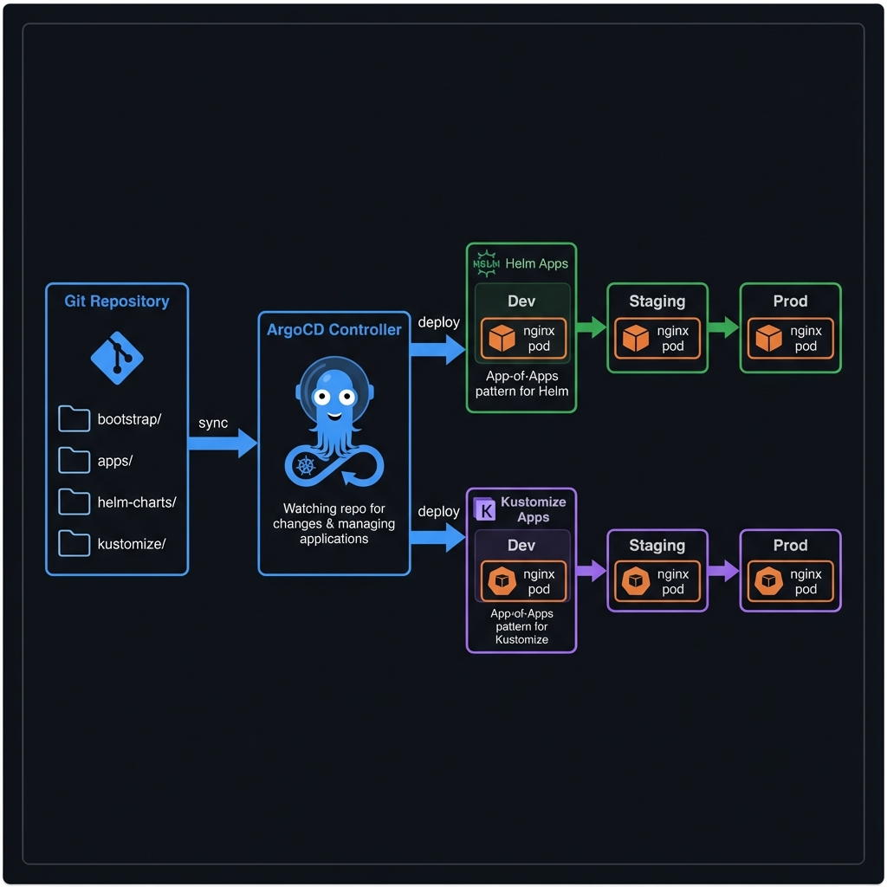
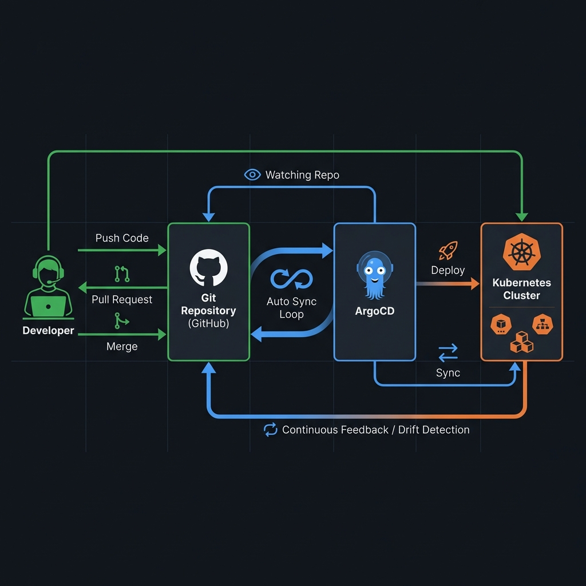

<p align="center">
  
</p>

<h1 align="center">ArgoCD App-of-Apps Lab</h1>

<p align="center">
  <strong>A hands-on lab for learning the App-of-Apps pattern with Helm and Kustomize</strong>
</p>

<p align="center">
  <a href="https://argoproj.github.io/argo-cd/"></a>
  <a href="https://kubernetes.io/"></a>
  <a href="https://helm.sh/"></a>
  <a href="https://kustomize.io/"></a>
</p>

<p align="center">
  <a href="#-use-this-as-a-template">Use as Template</a> •
  <a href="#quick-start">Quick Start</a> •
  <a href="#features">Features</a> •
  <a href="#architecture">Architecture</a> •
  <a href="#usage">Usage</a> •
  <a href="#contributing">Contributing</a>
</p>

---

## What's This About?

This repo is a practical playground for learning how to structure GitOps deployments using ArgoCD's App-of-Apps pattern. Whether you prefer Helm charts or Kustomize overlays (or both!), there's an example here for you.

The goal is simple: show you a real-world-ish setup that you can fork, modify, and use as a starting point for your own projects.

---

## 🚀 Use This as a Template

Want to use this for your own project? Here's how:

### Quick Setup (Recommended)

```bash
# 1. Fork and clone
git clone https://github.com/YOUR-USERNAME/argocd-lab.git
cd argocd-lab

# 2. Run the setup script
./setup.sh

# 3. Push to your repo
git add -A && git commit -m "Configure for my environment" && git push

# 4. Deploy to ArgoCD
kubectl apply -f bootstrap/root-app.yaml
```

The setup script will prompt you for:
- **Git provider** (GitHub, GitLab, Bitbucket, Azure DevOps, or custom)
- Repository details
- Git branch
- ArgoCD namespace

It automatically updates all manifest files with your values.

### Manual Configuration

If you prefer to do it manually, update these values in all YAML files:

| Find | Replace With |
|------|--------------|
| `https://github.com/arramandhanu/argocd-lab.git` | Your repo URL |
| `targetRevision: main` | Your branch |

See [Configuration Reference](docs/CONFIGURATION.md) for the full list.

---

## Features

| Feature | Description |
|---------|-------------|
| 🎯 **App-of-Apps Pattern** | One root application manages all child apps |
| ⚙️ **Helm Charts** | Complete nginx chart with templates, values per environment |
| 🔧 **Kustomize Overlays** | Base + overlays for dev, staging, and prod |
| 📦 **ApplicationSets** | Auto-generate apps from lists or directories |
| 🌍 **Multi-Environment** | Separate configs for dev, staging, production |
| 🔐 **Security Best Practices** | Non-root containers, resource limits, pod anti-affinity |
| 🔗 **Multi-Repo Support** | Manage 35+ microservices in external repos ([guide](docs/MULTI_REPO_GUIDE.md)) |

## Architecture

Here's the high-level flow of how everything connects:



And here's how the GitOps workflow operates:



## Directory Structure

```
argocd-lab/
├── bootstrap/                    # Root app-of-apps
│   └── root-app.yaml            # Bootstrap everything from here
│
├── apps/                         # ArgoCD Application manifests
│   ├── helm/                    # Helm-based apps (dev, staging, prod)
│   └── kustomize/               # Kustomize-based apps (dev, staging, prod)
│
├── applicationsets/             # Generate apps automatically
│   ├── helm-appset.yaml        # List generator for Helm
│   └── kustomize-appset.yaml   # Git directory generator for Kustomize
│
├── helm-charts/                 # Helm chart source
│   └── nginx/
│       ├── Chart.yaml
│       ├── values.yaml          # Default values
│       ├── values-dev.yaml
│       ├── values-staging.yaml
│       ├── values-prod.yaml
│       └── templates/
│
├── kustomize/                   # Kustomize source
│   └── nginx/
│       ├── base/               # Shared base manifests
│       └── overlays/
│           ├── dev/
│           ├── staging/
│           └── prod/
│
├── projects/                    # ArgoCD Projects for access control
│   ├── helm-project.yaml
│   └── kustomize-project.yaml
│
└── docs/                        # Extra documentation and images
```

## Prerequisites

Before you start, make sure you have:

- Kubernetes cluster (minikube, kind, k3s, or any managed K8s)
- ArgoCD installed ([installation guide](https://argo-cd.readthedocs.io/en/stable/getting_started/))
- `kubectl` configured
- `helm` v3.x (optional, for local testing)
- `kustomize` (optional, for local testing)

## Quick Start

### Option 1: Deploy Everything (App-of-Apps)

This approach uses the root application to bootstrap all apps:

```bash
# Clone the repo
git clone https://github.com/arramandhanu/argocd-lab.git
cd argocd-lab

# Apply the root application
kubectl apply -f bootstrap/root-app.yaml
```

ArgoCD will automatically discover and sync all applications under the `apps/` directory.

### Option 2: Deploy Individual Apps

If you want more control, deploy apps one at a time:

```bash
# Deploy a single Helm-based app
kubectl apply -f apps/helm/nginx-helm-dev.yaml

# Or deploy a Kustomize-based app
kubectl apply -f apps/kustomize/nginx-kustomize-dev.yaml
```

### Option 3: Use ApplicationSets

ApplicationSets auto-generate apps based on generators:

```bash
# Helm apps for all environments
kubectl apply -f applicationsets/helm-appset.yaml

# Kustomize apps (auto-discovers overlays)
kubectl apply -f applicationsets/kustomize-appset.yaml
```

### Option 4: Multi-Repo Microservices

Have 35+ microservices in separate repos? Use the microservice generator:

```bash
# Add one service interactively
./add-microservice.sh --single

# Or batch generate from config
./add-microservice.sh

# Or generate an ApplicationSet
./add-microservice.sh --appset
```

See the full [Multi-Repo Guide](docs/MULTI_REPO_GUIDE.md) for managing large-scale deployments.

## Usage

### Testing Locally

You can validate the manifests before pushing to Git:

```bash
# Validate Helm chart
cd helm-charts/nginx
helm lint .
helm template test-release . -f values-dev.yaml

# Validate Kustomize
kustomize build kustomize/nginx/overlays/dev
kustomize build kustomize/nginx/overlays/prod
```

### Customizing for Your Project

1. **Fork this repo** to your own GitHub account

2. **Update the repo URLs** in all Application manifests:
   ```yaml
   source:
     repoURL: https://github.com/YOUR-USERNAME/YOUR-REPO.git
   ```

3. **Modify the Helm values** or **Kustomize patches** to fit your app

4. **Push changes** and watch ArgoCD sync automatically

### Environment-Specific Configs

| Environment | Replicas | Resources | Features |
|-------------|----------|-----------|----------|
| **Dev** | 1 | Low (25m CPU, 32Mi) | Debug-friendly |
| **Staging** | 2 | Medium (100m CPU, 128Mi) | HPA enabled |
| **Prod** | 3 | High (200m CPU, 256Mi) | HA, pod anti-affinity |

## Helm vs Kustomize: When to Use Which?

Pick the approach that fits your workflow:

| Use Helm When... | Use Kustomize When... |
|------------------|----------------------|
| You need complex templating logic | You prefer overlay-based patching |
| Reusing charts across teams | Simple modifications to base YAMLs |
| Managing third-party charts | You don't want template syntax |
| Generating dynamic configs | GitOps-native workflows |

Or just use both—ArgoCD handles either approach just fine.

## Troubleshooting

### App stuck in "Progressing"

Check if the namespace exists and resources are healthy:

```bash
kubectl get pods -n nginx-helm-dev
kubectl describe application nginx-helm-dev -n argocd
```

### Sync failed with "permission denied"

Make sure the ArgoCD Project allows the target namespace:

```bash
kubectl get appproject default -n argocd -o yaml
```

### Helm values not applied

Verify the `valueFiles` path is correct relative to the chart:

```yaml
source:
  helm:
    valueFiles:
      - values-dev.yaml  # Must exist in the chart directory
```

## Contributing

Contributions are welcome! Feel free to:

- Open issues for bugs or feature requests
- Submit PRs with improvements
- Share feedback on the structure

## License

MIT License. See [LICENSE](LICENSE) for details.

---

<p align="center">
  Made with ☕ and <a href="https://argoproj.github.io/argo-cd/">ArgoCD</a>
</p>
